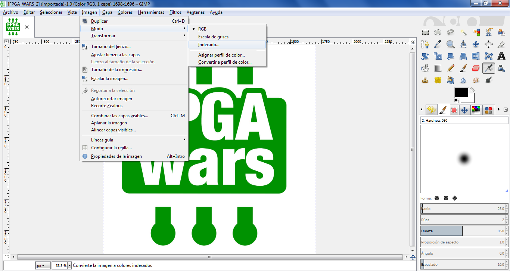
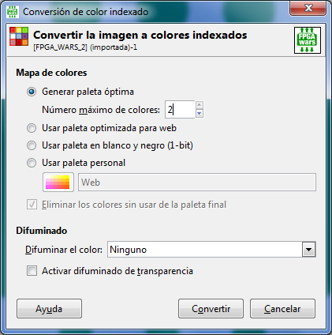
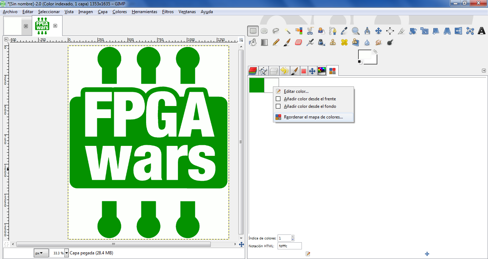
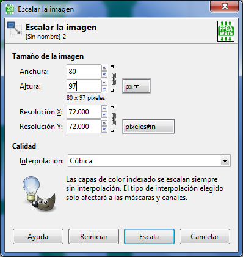

# Proyecto *screen-logo*.
Este proyecto surge como una posibilidad más de experimentar con las señales VGA generadas desde una FPGA. Se basa en los trabajos realizados por los compañeros de *FPGAWars* [@Obijuan](https://github.com/Obijuan) y [@RCoeurjoly](https://github.com/RCoeurjoly/Space-Invaders), así como en conceptos tomados de otros proyectos.

[TOC]

## Diagrama de bloques.
Los bloques que describen el proyecto del ***screen-logo*** se han pensado para que sean, en la medida de lo posible, bloques fácilmente exportables, sustituibles y ampliables para su fácil utilización en otros proyectos de este estilo. Estos bloques se han pensado para tener en todo momento separados los conceptos gráficos, dinámicos y de sonido. Separando a su vez los controladores que realizan la interfaz con el exterior.

El diagramade bloques y su relación se puede ver en el siguiente esquema.


## Código Verilog.
Para el código HDL de descripción de bloques se ha usado Verilog. La idea es utilizar herramientas libres en el desarrollo del proyecto. A la hora de escribir el código simplemente se han trasladado los diagramas de bloques en los siguientes ficheros:

- **top.v** - Engloba y encapsula todo el sistema de bloques, sus entradas y salidas son directamente las entradas y salidas de los pines de la FPGA (descritos en **top.pcf**).
- **vga_controller.v** - Genera las señales externas de la VGA hacia el monitor. Se utiliza, prácticamente sin modificaciones, el módulo creado por *@RCoeurjoly* para el proyecto *SpaceInvaders*.
- **sound_controller.v** - Genera las señales externas para generar sonido (en proceso).
- **logo.v** - Incluye todo el comportamiento en dinámica, sonido y visualización del logo por pantalla. Compuesto por otros módulos descritos en otros ficheros.
	- **dinamic.v** - Se encarga de generar la dinámica del logo por pantalla, su rebote en los bordes y la asignación de un sonido para el controlador.
	- **graphic.v** - Se encarga de generar la imagen completa en pantalla, para ello utiliza la posición del logotipo y su imagen. Utiliza un módulo internamente que genera la imagen.
		- **imagen.v** - Genera la imagen del logotipo, para ello carga el fichero desde el disco en formato ASCII (**logo.txt**) y lo entrega al módulo graphics en formato binario según la posición relativa en la que se encuentra en ese momento el logotipo.

## Generar imagen del *logo*.
Para cargar la imagen que vamos a animar haciéndola rebotar por la pantalla, necesitamos leer desde el código Verilog un fichero de texto con los valores binarios de la imagen. De dimensiones no mayores a *100x100 pixels* para evitar reducir drásticamente los recursos de memoria de nuestra FPGA.

Si quieres generar tu propio logotipo debes realizar los siguientes pasos:
- Abrimos la imagen con en el programa GIMP y cambiamos a un modo indexado de representación de la imagen.



- Convertimos la imagen con paleta óptima de dos colores.



- Esto nos generará una imagen binaria con los colores verde y blanco. Comprobamos el mapa de colores y podemos encontrar que asigna el índice cero al verde y el uno al blanco. Aunque esto siempre se puede modificar en el código Verilog, podemos reordenar el mapa de colores para una asignación más lógica (el cero como fondo y el uno como color).



- Una vez reordenado el mapa de colores, si no lo hicimos anteriormente, es la hora de recortar la imagen lo máximo posible para que se usen los mínimos bits al representar la imagen. Posteriormente se escala.


- En nuestro caso elegimos, por aprovechar recursos, un tamaño inferior a *100x100* sin que deforme en exceso la imagen.



- Una vez escalada la imagen guardamos (exportamos) en formato PNG. Esta imagen se utilizará ahora desde *Matlab* para cargar y procesar los bits según la matriz creada a partir de la propia imagen. Para ello se ejecutan las siguientes líneas de código.

```matlab
img = imread('FPGA_WARS-binario-80x96.png');   % Carga la imagen en la matriz 'img'.
dlmwrite("logo.txt",img,'delimiter','');       % Pasa la matriz a texto.
```
- Una vez hecho esto, en el fichero *"logo.txt"* dispondremos de la imagen en formato de *unos* y *ceros*. Se puede editar este fichero y añadir comentarios (//) que no afectarán a la carga desde Verilog. No olvidar actualizar el parámetro *"FILE_LOGO"* del código Verilog en *"imagen.v"* si se ha decidido cambiar el nombre del fichero.

## Instalación y sintetizado.
Para la prueba del código se han utilizado las herramientas libres del proyecto ***icestorm***, más concretamente el código se encuentra preparado para la tarjeta [***iceZum Alhambra***](https://github.com/FPGAwars/icezum/wiki) y la herramienta [***Apio***](http://apiodoc.readthedocs.io/en/stable/).

Si dispones de una ***iceZum Alhambra***, simplemente descomprime o clona el proyecto y ejecuta desde consola:

```bash
	# apio upload
```

Las conexiones VGA necesarias para conectar el monitor a la tarjeta FPGA las puedes encontrar, muy bien explicadas, en el proyecto [***MonsterLED***](https://github.com/Obijuan/MonsterLED/wiki) de *Obijuan*.

